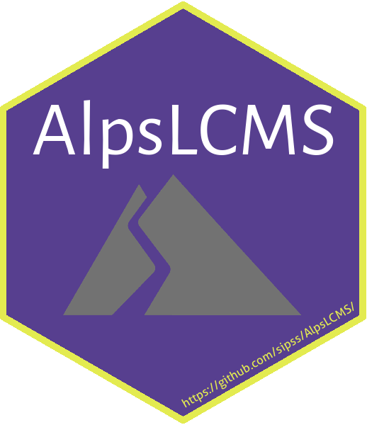

# AlpsLCMS 


[](https://www.tidyverse.org/lifecycle/#maturing)
[](https://github.com/sipss/AlpsLCMS/actions/) 
[](https://codecov.io/github/sipss/AlpsLCMS)
[](https://sipss.github.io/AlpsLCMS/)

The goal of `AlpsLCMS` is to offer a data analysis preprocessing pipeline for LC/MS
metabolomic samples.

## Installation

AlpsLCMS can be installed with the `devtools` package. For this is needed Rtools and note that it uses packages from CRAN, from BioConductor and from git repositories: 

``` r
if (!requireNamespace("BiocManager", quietly = TRUE))
    install.packages("BiocManager")
    
if (!requireNamespace("devtools", quietly = TRUE))
    install.packages("devtools")
    
if (!requireNamespace("remotes", quietly = TRUE))
    install.packages("remotes")
    
BiocManager::install(c("xcms", "mzR"))
BiocManager::install(c("CAMERA", "MAIT"))
BiocManager::install(c("GenomicFeatures", "AnnotationDbi"))
BiocManager::install(c("IPO", "faahKO"))
remotes::install_github("cbroeckl/RAMClustR")
devtools::install_git("https://gitlab.com/CarlBrunius/StatTools.git")

devtools::install_github("sipss/AlpsLCMS")
```


Quick start
========================

Checkout the [Introduction to AlpsLCMS](https://sipss.github.io/AlpsLCMS/articles/introduction-to-alpslcms.html) vignette that shows how to import data and preprocess it using `AlpsLCMS`.
